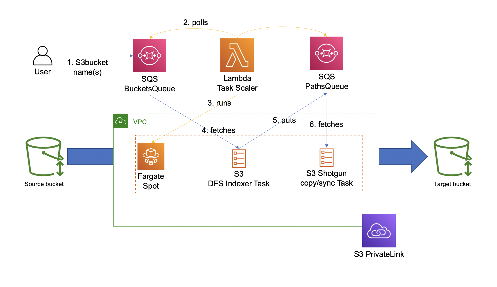

# s3shotgun

s3shotgun is a small utility which can run arbitrary AWS CLI commands on S3 objects, e.g. consolidate multiple S3 buckets into a single one across multiple accounts across multiple regions from multiple owners, in a very fast and relatively cheap manner.

Specifically, for the pre-coded CLI command, S3 shotgun launches Fargate spot tasks in ECS which syncs S3 buckets based on paths stored in SQS. AWS themselves [recommend running multiple instances of the sync command in parallel](https://aws.amazon.com/premiumsupport/knowledge-center/s3-improve-transfer-sync-command/) - s3shotgun can run as many Fargate tasks as your limit will allow (default 500).

## Deployment
### Requirements
* Admin credentials in an AWS account (s3shotgun needs to create some IAM roles)
* NodeJS 12.x
* CDK
* Docker
* READ permissions in **every** source S3 bucket (e.g. by principal)
* WRITE permissions in the target S3 bucket

Once requirements are satisfied:
1. Copy, rename, and modify `bin/cdkStack.ts.example` to fit your environment. At minimum, you **MUST** replace:
```
process.env.TARGET_BUCKET = 'my-target-bucket';
const env = {account: '123456789012', region: 'eu-west-1'}
```

2. Use the command `cdk synth` to check that everything works
3. `cdk bootstrap aws://[account-id]/[aws-region]`, (e.g. `cdk bootstrap aws://123456789012/eu-west-1`)
4. `cdk deploy`

It's simpler to deploy and run s3shotgun in the S3 target account than in every source account, but if it's easier for you it makes no difference where you deploy as long as the necessary permissions in S3 are in place.

## Running
The queue consumer runs the following `aws s3` CLI command per default:
```
aws s3 [sync|cp] s3://[s3-source-path] s3://[s3-target-path] --acl bucket-owner-full-control --storage-class STANDARD_IA --cli-connect-timeout 0
```

s3shotgun consumes messages from the `bucketQueue`, which should have the automatically generated URL `https://sqs.[region].amazonaws.com/[account-id]/s3ShotgunBucketsQueue`

...with the required attributes:
```json
"MessageAttributes": {
    "Bucket": {
        "DataType": "String",
        "StringValue": "my-bucket"
    }
}
```

You can put messages with the required attributes yourself, or use the script provided in `assets/queuePusher/pushBucketsToQueue.js`

Example to push the path of `my-bucket`:

```bash
node assets/queuePusher/pushBucketsToQueue.js -q https://sqs.eu-west-1.amazonaws.com/123456789012/s3ShotgunBucketsQueue -b my-bucket
```

# Architecture and design choices



A lambda function continuously polls two SQS queues for messages. When a user puts a message in the bucket queue, Fargate will deploy a task indexing the contents of that S3 bucket. Each path to be either synced or copied will be sent to the Paths queue. The same lambda function will launch as many Fargate tasks as is possible/appropriate to carry out the sync and copy operation. All data transfer is done over S3 private link to maximize performance.

## Design choices
* The indexing function uses a [DFS](https://en.wikipedia.org/wiki/Depth-first_search) to a specified depth to generate paths for directories and files, while discarding any path to a parent path to a child path (i.e. if we sync both s3://parent/child and s3://parent, the child path would be synced twice)
* The `MAXDEPTH` parameter specifies how deep the DFS traverses. Default is 6, but you should change it according to your needs and bucket structure. Ideally as many files as possible should be using the `aws s3 sync` command, which is faster than just `aws s3 cp`. This means you don't want to "bottom out" in the DFS; if your maximum bucket depth is 3 set to 2. 6 is chosen since it suits Organization cloudtrail bucket structures.
* ECS autoscaling can't scale down to zero. An easy workaround is to implement a lambda scaling function which is able to deploy new tasks.
* Letting the tasks kill themselves graciously when the queue is empty means we don't have to worry about scaling down when the job is completed.
* Ideally, you would run triggering events with SNS and Cloudwatch alarms to scale the tasks. But it has two caveats - Cloudwatch Alarms are more expensive than letting Lambda poll on a 1-minute schedule, and alarms do not fire during the alarm state, but only once when the threshold is reached (makes it hard to ramp up ECS tasks, which can only be added 10 at a time)
* There is no native `s3 sync` functionality in the AWS NodeJS SDK. A fairly simple workaround is to invoke the CLI from NodeJS. This also makes s3shotgun extensible; you can easily adopt the code to run arbitrary CLI commands.

## Why not S3 Batch Operations?
* S3BO requires the generation of manifests, which can take up to 48 hours per bucket. The long feedback loop can make it very frustrating to work with!
* S3BO only supports cross-region operations for the PUT operation
* It can be very expensive ($1/1M object operations). For 1.4 billion files that's $1,400 for just a single operation pass, add the potential costs for Lambda invocations per object!
* Every S3BO operation is atomic, and costs money - with CLI, you can do several things with one call (e.g. copy, change ownership and change storage class)

## Why not S3 replication?
* Requires version control enabled on all buckets
* S3 replication always retains the metadata of objects
* Can't perform transformation or operations on objects
* Requires more permissions

### Why not EMR S3DistCp?


## TODO

* IAM permissions are super permissive. They should probably be tightened.
* Parameterize the task inputs
* The CLI command can probably be generalized in a clever way.
* ~~Draw architecture diagram and explain how everything fits together~~